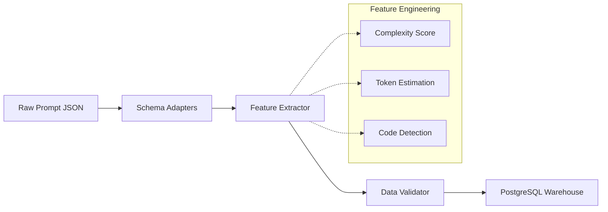
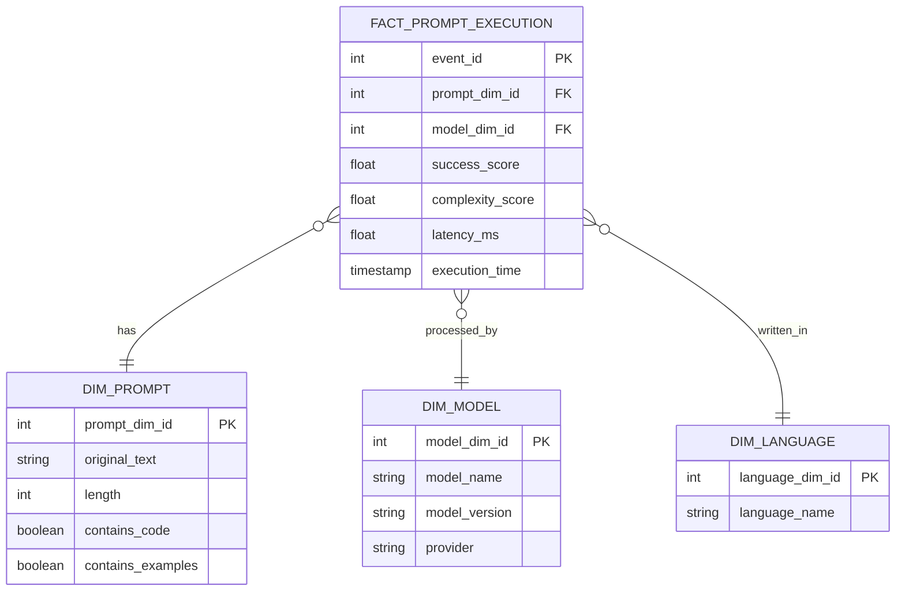

# Data Pipeline & ETL Architecture

PromptLens is driven by a heavily structured Data Engineering pipeline, ingesting raw multi-source text and mapping it to a highly structured Star Schema designed for OLAP operations.

## ETL Workflow

The ETL logic is isolated within the `etl/` directory and manages a complete end-to-end transformation framework.

### 1. Ingestion (`etl/ingestion/`)
Adapters dynamically load overlapping unstructured text records from sources like Chatbot Arena or ShareGPT, applying base schema alignments.

### 2. Transformation (`etl/transformation/`)
- Extracts over 15 targeted attributes per prompt execution.
- Calculates textual structure properties (`prompt_length`, token volumes).
- Identifies internal logic rules, triggering boolean flags (`contains_code`, `contains_examples`, `contains_constraints`).

### 3. Load & Data Warehousing (`etl/warehouse/`)
Utilizes a PostgreSQL database mapping to a highly structured Star Schema optimized for large-scale aggregations.

## Warehouse Star Schema

The database relies on multidimensional modeling to allow real-time analytical queries via the FastAPI layer.

### Materialized Views
Frequently accessed multi-join aggregations are cached as materialized views to serve real-time dashboard analytics with low latency, regularly refreshed by database triggers or cron tasks.
