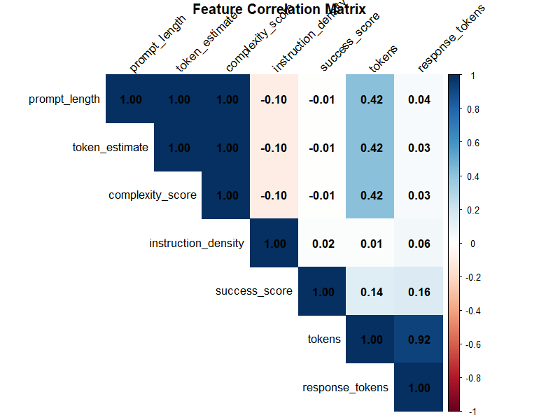
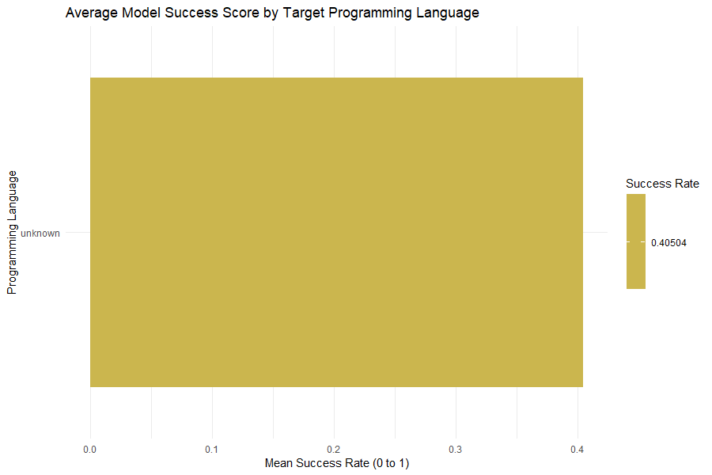
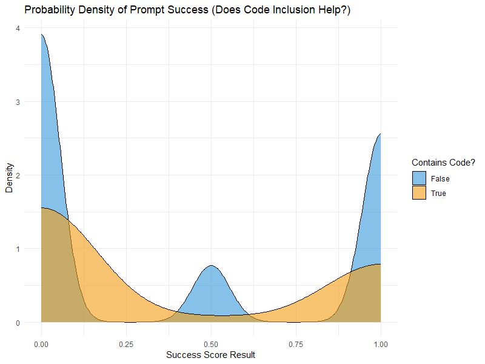
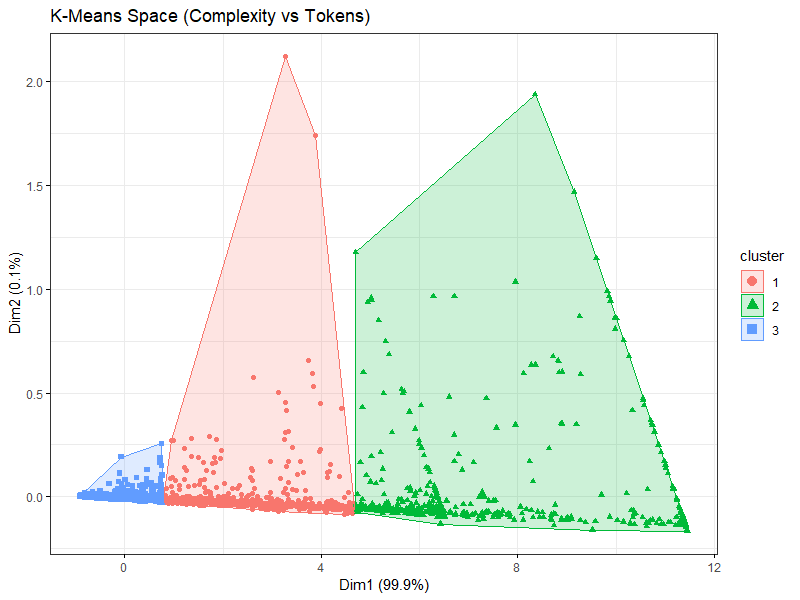
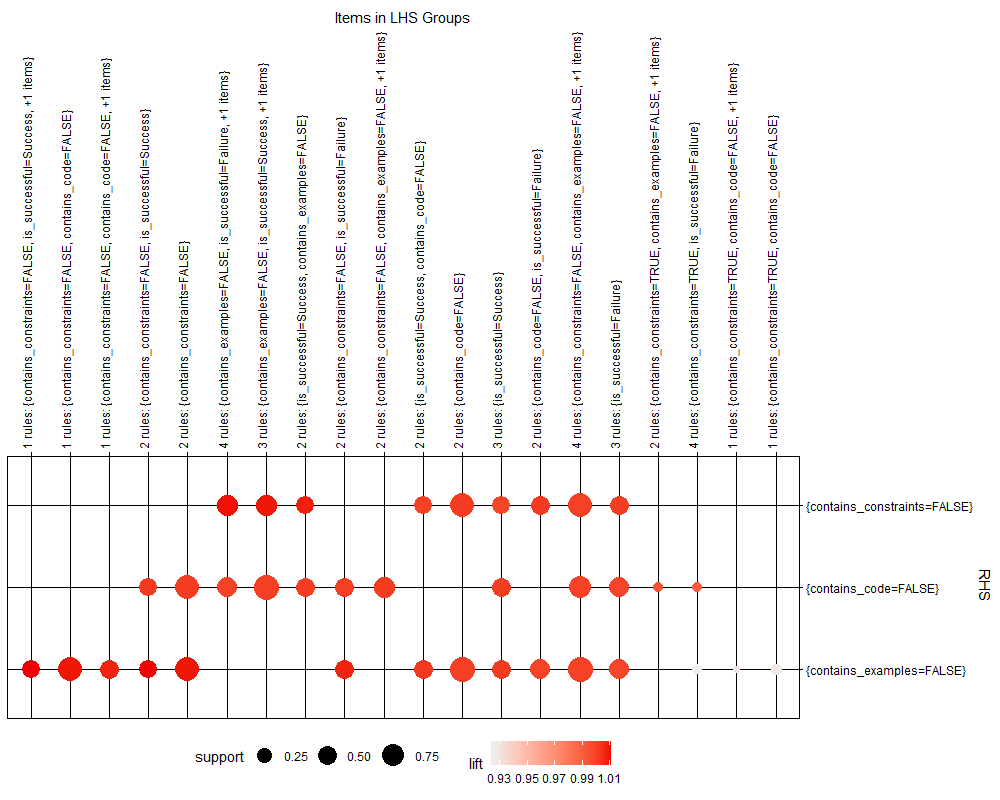
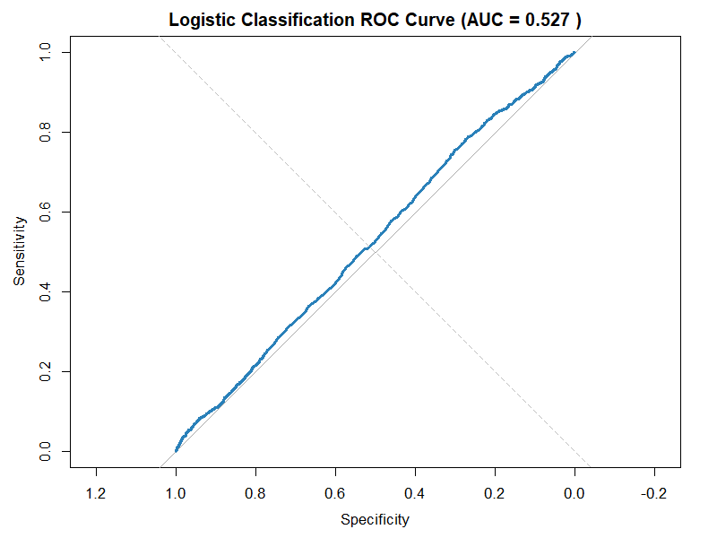

 # PromptLens Frontend Demo Talk Track (DWDM Semester Viva)

Use this as a practical script: what to click, what each widget *means*, and what to *interpret*.

## 0) One-line system framing (say this first)
PromptLens is a DWDM system that takes raw LLM prompt-execution logs, loads them into a star-schema PostgreSQL warehouse, builds OLAP materialized views for fast analytics, and uses data mining models (clustering + classification + association rules) to predict prompt quality and recommend improvements.

---

## 1) Metrics Dashboard (OLAP / Data Warehouse story)
Open: **Metrics Dashboard**

### A. ETL Executive Summary KPI cards (top row)
**What to say**
- “These are warehouse-level KPIs computed from OLAP materialized views.”

**What each KPI means**
- **Global Query Volume**: total number of prompt execution attempts included in the leaderboard slice.
  - Interpretation: volume indicates how much evidence the warehouse has for mining/OLAP.
- **Tracked Models**: number of distinct models currently visible in the leaderboard view.
  - Interpretation: shows the breadth of models being compared.
- **System Wide Success Rate**: average success rate across the tracked models.
  - Interpretation: a global health indicator (good for comparing datasets/time windows).
- **Feature Ablation Tests**: number of structural prompt feature combinations available (examples/code/constraints combos).
  - Interpretation: shows how we can attribute success differences to prompt structure.

### B. Automated Insights row (the “conclusions” row)
**What to say**
- “This row converts OLAP outputs into direct insights so a viewer doesn’t need to interpret charts manually.”

**What each insight means**
- **Top Model**: best model by success yield in the leaderboard view.
  - Interpretation: “If I want the highest success probability, choose this model.”
- **Hardest Language**: lowest success-rate programming language.
  - Interpretation: “This highlights where LLMs struggle; prompts for this domain need stronger constraints/examples.”
- **Best Prompt Structure**: the feature combo with best average success.
  - Interpretation: “This is prescriptive: add these elements when writing prompts.”
- **Worst Prompt Structure**: the least successful combo.
  - Interpretation: “This tells us what to avoid in prompt design.”

### C. Chart: Inference Viability by Model
**What to say**
- “This is an OLAP leaderboard showing success yield per model.”

**Interpretation**
- Taller bar = higher success percentage.
- Use it to justify model selection for deployments.

### D. Chart: Language Compilation Success
**What to say**
- “This is a slice-by dimension analysis: performance grouped by programming language.”

**Interpretation**
- Shows which domains are easy/hard for LLMs.
- Useful for curriculum-style insights: “CSS or X is the hardest language here.”

### E. Model Efficiency Tradeoff (Latency + Tokens vs Success)
**What to say**
- “This widget connects warehouse measures to cost/performance. Tokens approximate cost; latency approximates throughput/UX.”

**How to interpret columns**
- **Avg Success**: quality outcome.
- **Avg Latency**: speed outcome (may be null if the dataset didn’t record latency).
- **Avg Tokens**: cost proxy (prompt + response tokens).
- **Executions**: sample size / confidence.

**Important note to say if latency is missing**
- “Latency is not present for all datasets; the warehouse can still compare success vs token cost. Latency becomes available when we ingest runtime logs that include timing.”

### F. Highest Yielding Templates (Top prompt templates)
**What to say**
- “This ranks reusable prompt templates that have the most consistent success.”

**Interpretation**
- High uses + high yield = strong ‘prompt pattern’ worth reusing.
- Helps create prompt libraries for teams.

### G. Ablation Heat Matrix (Prompt feature impact)
**What to say**
- “This is controlled feature analysis: we compare success rates for combinations of examples, code blocks, and constraints.”

**Interpretation**
- Green/blue/purple blocks indicate which structural features were present.
- Higher % = structure that generally works better.

### H. 30-Day Sub-model Success Tolerance (Timeline)
**What to say**
- “This is a time-series OLAP view (roll-up by day) showing stability or drift.”

**Interpretation**
- Rising line = improving success trend.
- Falling line = regression or dataset shift.
- Useful for monitoring changes over time.

---

## 2) Predictive Analytics Lab (Data Mining story)
Open: **Predictive Analytics Lab**

### What to say (one-liner)
- “This page turns the mined patterns into action: we predict success for a new prompt and recommend improvements.”

### How to demo live (60–90 seconds)
1. Paste a vague prompt (example): `Explain this.` → Run
   - Say: “Low probability because it lacks structure: no constraints, no output format, no examples.”
2. Paste an improved prompt (example):
   - `Explain the code step-by-step. Output: (1) purpose, (2) inputs/outputs, (3) edge cases. Keep it under 120 words and include one example.` → Run
   - Say: “Probability improves because it’s measurable and constrained.”

### How to interpret widgets
- **Success Probability**: classifier prediction (likelihood of success based on historical features).
- **K-Means Segment**: which prompt ‘cluster/style’ it belongs to.
- **Ablation Recommendations**: suggested rewrites + projected success lift.
- **Extracted Sub-Features**: engineered features used in prediction (this links back to warehouse feature extraction).

---

## 3) Llama-3 Data Agent (Explainable / auditable querying)
Open: **Llama-3 Data Agent**

### What to say
- “This is a natural-language interface to the data warehouse. The key point: it’s auditable.”

### How to demo live
- Toggle **Trace ON**.
- Ask: “Top 5 models by average success with attempts.”
- While it answers, point to the trace panel:
  - “Here are the exact tool calls, the SQL it executed, how many rows came back, and a sample of the warehouse result.”

### Why this matters
- It’s not a black box: professors can see the system’s reasoning inputs (queries + results), which is important for trust and reproducibility.

---

## 4) R Script Result Figures (EDA + Modeling + Evaluation)
Open: **Results Figures** (generated by R scripts)

These plots are produced by our R pipeline (EDA + modeling + evaluation) and saved in `results/figures/` (also mirrored into the frontend under `promptlens-frontend/public/results/figures/`).

### A. Feature Correlation Matrix (`correlation_matrix.png`)

**What to say**
- “This is exploratory analysis: it shows how our engineered numeric prompt features correlate with each other.”

**Interpretation**
- Values closer to +1 mean two features rise together; closer to -1 mean they move oppositely.
- Use it to justify feature selection (e.g., spotting collinearity between length/tokens/complexity-like measures).

### B. Average Success by Target Programming Language (`language_difficulty.png`)

**What to say**
- “This aggregates average `success_score` by `language`, and filters out rare languages to avoid noise.”

**Interpretation**
- Lower mean success = harder language/domain (needs stronger constraints/examples in prompts).
- This supports the dashboard story: success can be analyzed by dimensions (language is a core dimension).

### C. Success Density Split by Code Inclusion (`success_density.png`)

**What to say**
- “This compares the distribution of `success_score` when prompts include code vs when they don’t.”

**Interpretation**
- If the ‘Contains Code = True’ curve shifts right (toward 1), code inclusion tends to improve success.
- Heavy overlap means the effect is weak or context-dependent (so it’s a guideline, not a guarantee).

### D. K-Means Prompt Segments (`cluster_plot.png`)

**What to say**
- “This is unsupervised clustering: we group prompts into 3 segments (K = 3) using numeric features.”
- “Clustering is based on standardized `complexity_score`, `prompt_length`, and `token_estimate` (so length/tokens/complexity contribute comparably).”
- “Important: K-Means does **not** use the success label — it groups by prompt ‘shape/cost’, not by outcome.”

**Interpretation**
- Each point is a prompt execution record; colors show cluster membership (prompt ‘style’/segment).
- The plot is a 2D PCA projection for visualization (Dim1/Dim2); the clustering itself happens in 3D feature space.
- In our saved dataset sample (25,000 rows), the clusters map to “prompt archetypes”:
  - **Cluster 3 (most common)**: short + low-token + low-complexity prompts (mean `prompt_length` ≈ 89 chars, `token_estimate` ≈ 23).
  - **Cluster 1**: medium-to-long + medium token prompts (mean `prompt_length` ≈ 695 chars, `token_estimate` ≈ 171).
  - **Cluster 2 (rarest)**: very long + high-token + high-complexity prompts (mean `prompt_length` ≈ 1,809 chars, `token_estimate` ≈ 441).
- This connects directly to the **K-Means Segment** widget in the Predictive Analytics Lab.

### E. Association Rules Network (Apriori) (`association_rules.png`)

**What to say**
- “This mines frequent patterns linking prompt structure features (code/examples/constraints) to success or failure.”

**Interpretation**
- Nodes represent feature-value items (e.g., `contains_constraints=TRUE`, `is_successful=Success`).
- Edges represent rules; larger nodes indicate higher support (more common), and stronger coloring indicates higher lift (more ‘interesting’ than chance).
- These patterns justify the **Ablation Recommendations**: which prompt features tend to co-occur with successful outcomes.

### F. Logistic Classification ROC Curve (`roc_curve.png`)

**What to say**
- “This evaluates our baseline logistic regression classifier on a held-out test split using ROC/AUC.”

**Interpretation**
- The closer the curve is to the top-left, the better the classifier; AUC near 0.5 indicates near-random performance.
- We treat this as a **baseline** and motivate richer features + multiple modeling views (classification + clustering + rules) rather than relying on one model.

---

## 5) If something is empty during demo (safe lines)
- **If Model Efficiency is empty**: “This happens when latency isn’t present in the dataset slice. Tokens + success are still meaningful; latency becomes available once runtime logs include timing fields.”
- **If an endpoint is slow**: “The backend is deployed on cloud; response time depends on network and cold starts.”

---

## 6) Closing (10 seconds)
- “So the dashboard is OLAP (warehouse views), the lab is data mining (predict + recommend), and the agent is explainable access (audited SQL/tool trace). Together that’s the complete DWDM lifecycle.”
